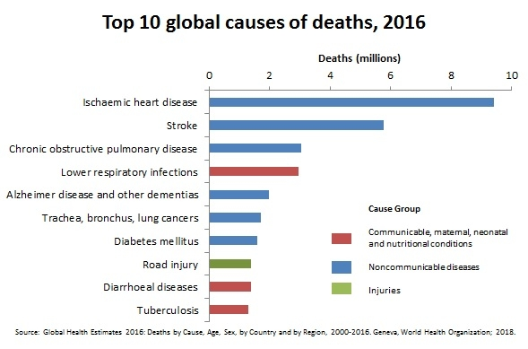
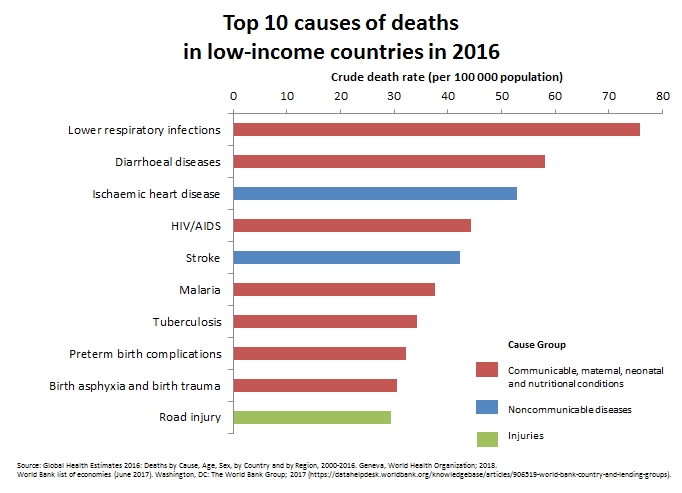
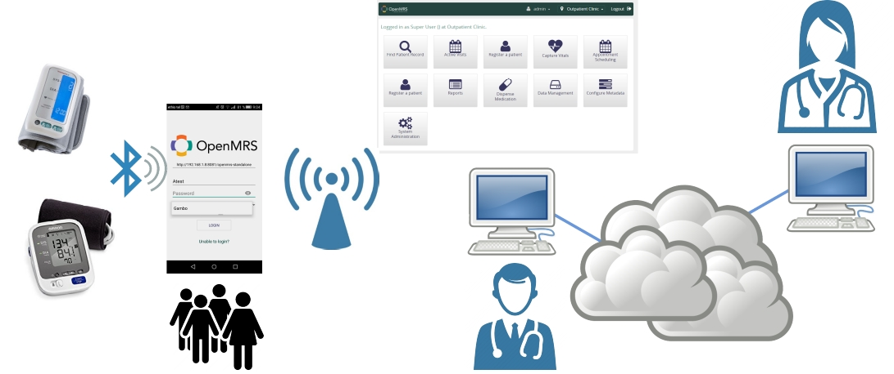

# Some introduction about the project

The project consists in developing a **client / server application** based on mobile devices and open software [OpenMRS](https://openmrs.org/) that allows the **automated collection of biomedical data** in areas with little or no coverage of mobile communications. This system is aimed to local agents with low or null medical and technological knowledge that **will improve the treatment of hypertension in remote areas**.

# Why?

If we take a look, data speaks for itself:

# How?

Here it goes a scheme of the whole system

# What?

It is intended to move from an initial situation where - according to international studies that have been done previously mentioned, resources are lacking to address the problems of arterial hypertension - to a controlled situation, bringing us the technology and The procedures we deem opportune, under the guidance of doctors specialists, to achieve an evolution in the treatment of HTA using resources that use less energy and that are easier to use for users without technical preparation.  

It is intended, therefore, to reduce the ignorance of cardiovascular diseases, increase adherence to treatment and increase the number of treatments. In the long term, it is intended to reduce the number of deaths due to cardiovascular diseases.  

In conclusion, making countries that do not currently have the resources to fight against HAT have the possibility of a specially designed system.
