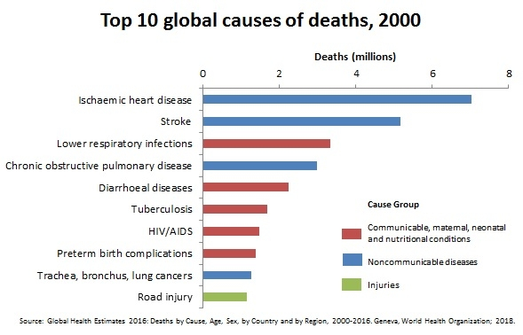

# Some introduction about the project

The project consists in developing a client / server application based on mobile devices and open software [OpenMRS](https://openmrs.org/) that allows the automated collection of biomedical data in areas with little or no coverage of mobile communications. This system is aimed to local agents with low or null medical and technological knowledge that will improve the treatment of hypertension in remote areas.

# Why?

Here some data about **ischemic heart disease**

### my history

To be honest, I'm having some trouble remembering right now, so why don't you just watch [my movie](http://en.wikipedia.org/wiki/The_Princess_Bride_%28film%29) and it will answer **all** your questions.
